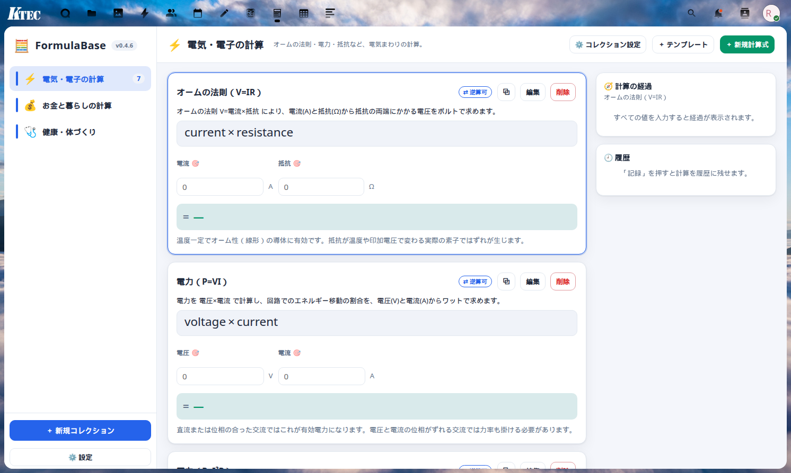
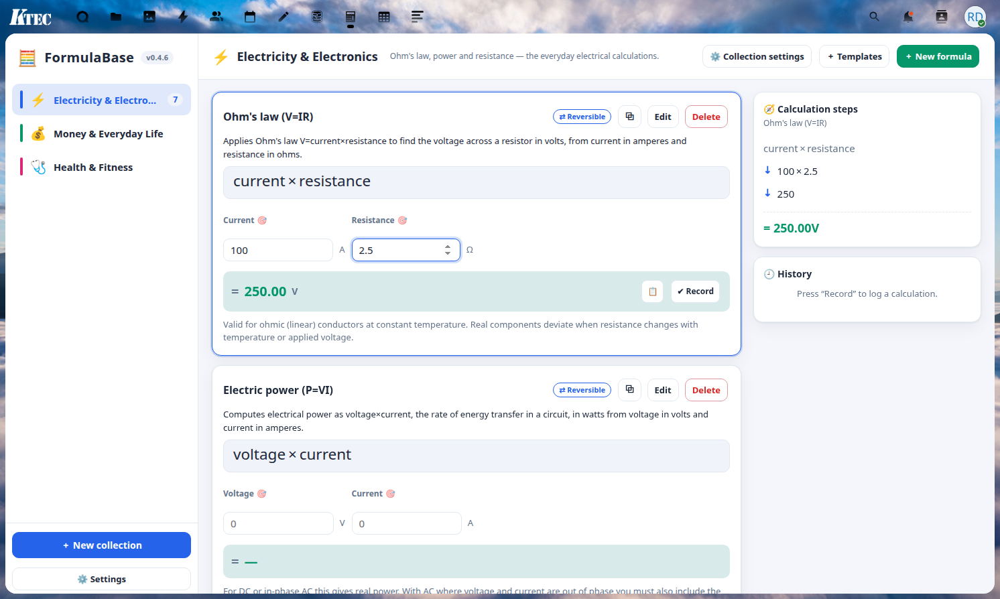
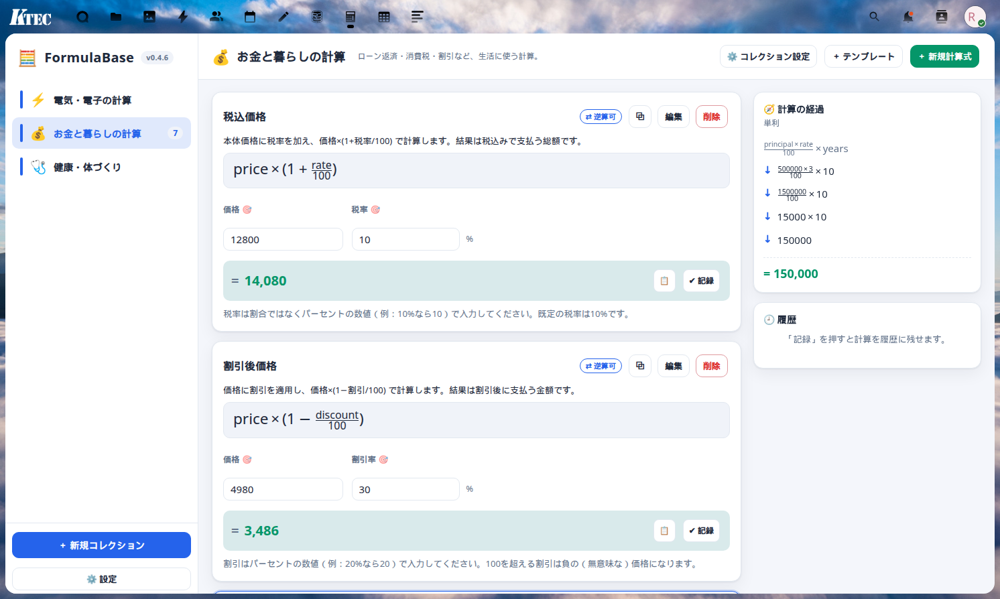
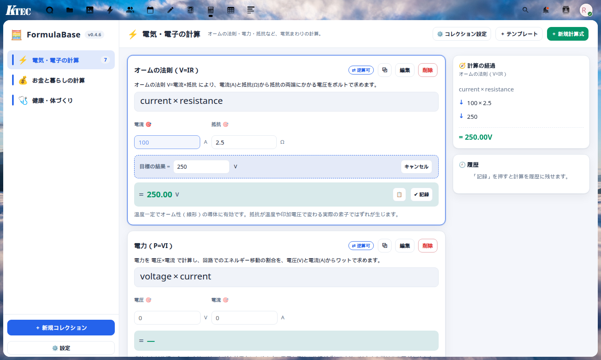
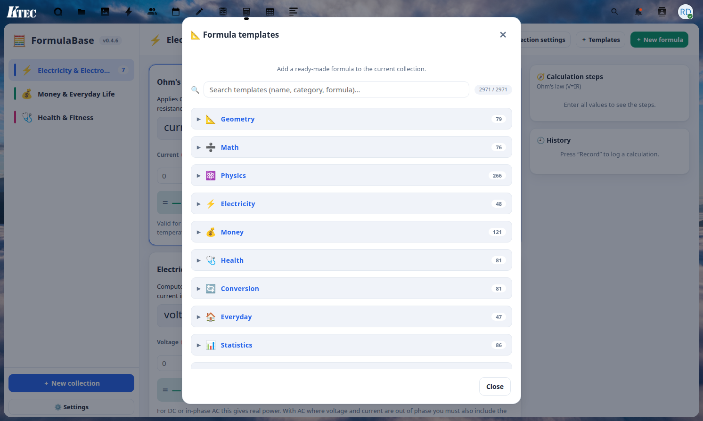
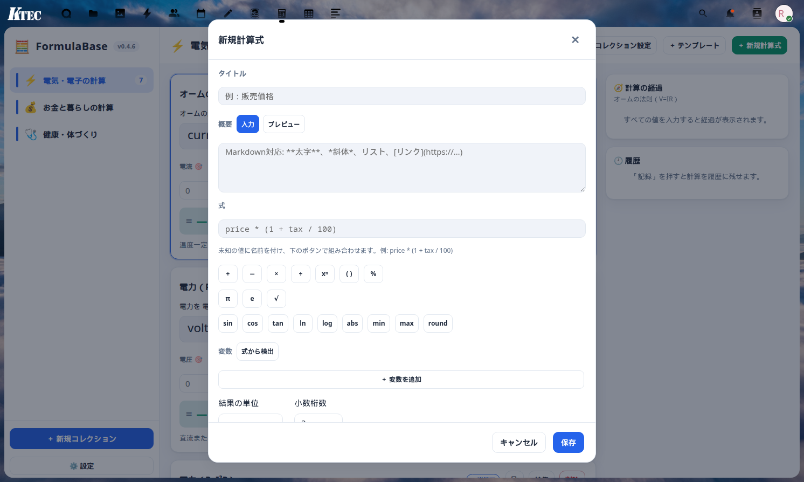
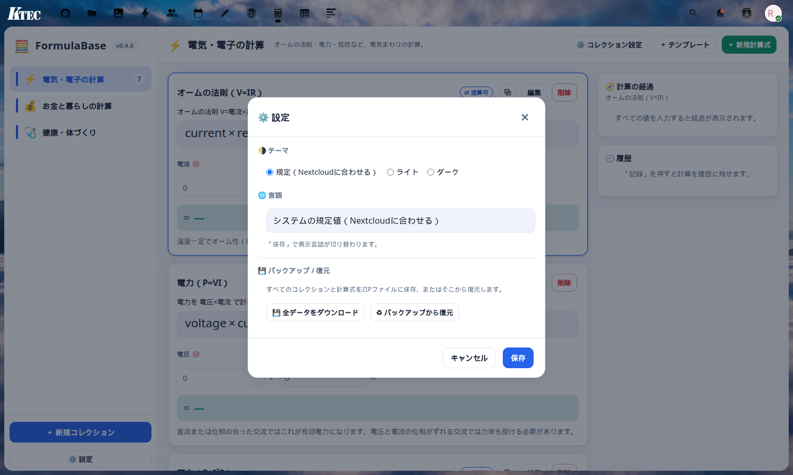
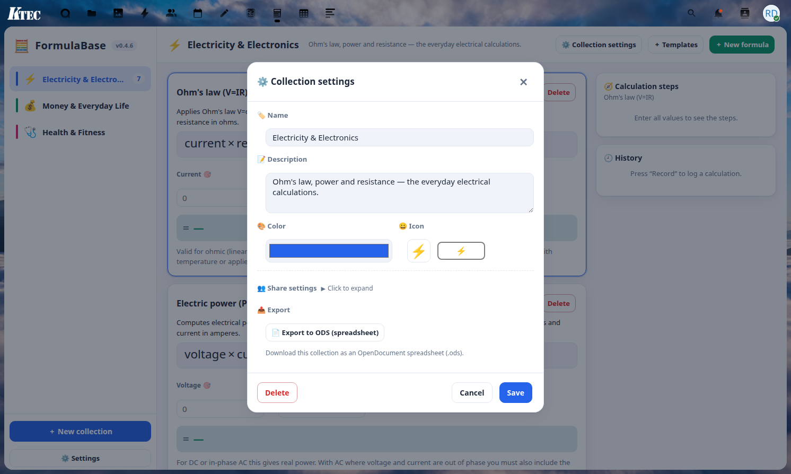

# FormulaBase 🧮

**Save your own formulas, type in numbers, and calculate instantly — a personal calculator app for Nextcloud, with nearly 3,000 built-in formula templates to get you started.**
**自分の計算式を登録して、数値を入れるだけで即計算できる Nextcloud 向けアプリ。約3,000件の組み込みテンプレート付き。**

> Personal project · self-hosted · runs entirely inside your own Nextcloud.
> 個人プロジェクト · セルフホスト · あなた自身の Nextcloud の中だけで動作します。

[English ↓](#english) · [日本語 ↓](#japanese)

---

## English

FormulaBase is a lightweight personal calculator for the formulas you use again and again — markups, unit conversions, loan payments, mixing ratios, engineering constants, anything.

Organise your formulas into **collections**, define each formula's **variables** once, then open it any time, type in numbers, and read the result **live**. A right-hand panel shows the **step-by-step calculation** (values substituted in, then reduced one operation at a time), and every calculation you press **Record** on is kept in a per-formula **history** stored on the server.

### Why FormulaBas

- **You don't start from a blank page.** FormulaBase ships with **3,122 ready-made formula templates across 63 categories** — physics, geometry, finance, health & medicine, chemistry, electricity & electronics, astronomy, computing, statistics, materials science, and many more. Search the library, drop a template straight into your own collection, and start calculating — no need to type out the formula yourself.
- **Nothing leaves your browser.** The expression engine is a small hand-written parser/AST evaluator — **no `eval`, no `new Function`, no `unsafe-eval`**. Every calculation runs client-side, instantly, with no round-trip to the server and no code-injection surface.
- **You can see the math, not just the answer.** The step-by-step trace panel substitutes your values into the formula and reduces it one operation at a time, so you (or a student, or a colleague) can follow exactly how the result was reached.
- **Your work is never lost.** Every formula keeps its own history on the server — record a calculation, restore it later, delete what you don't need, scoped per user.
- **Built for teams, not just individuals.** Share a collection with other Nextcloud users at three permission levels (view / edit / delete), so a department can maintain one shared set of formulas instead of everyone reinventing them.
- **Speaks your language.** The UI and the entire 3,122-formula template library are localized — English, Japanese, Spanish, Chinese, French, German, Portuguese and more, with full technical/scientific terminology, not just menu labels.

### Features
- **3,122 built-in formula templates across 63 categories** — searchable and ready to drop into your own collections
- Collections of reusable formulas
- Named variables with labels, units and default values
- **Safe expression engine** — a small parser/AST evaluator, **no `eval` / no `new Function`** (no `unsafe-eval`): `+ - * / % ^`, parentheses, and functions `sqrt cbrt abs round floor ceil trunc sign exp ln log log2 sin cos tan asin acos atan min max pow mod hypot root`, constants `pi e tau`. Unicode (incl. Japanese) variable names supported.
- **Live result** as you type, with unit and decimal-place control
- **Step-by-step trace** of the calculation
- **Server-side history** per formula (record / restore / delete / clear), scoped per user
- **Internal sharing** — share a collection with other Nextcloud users at three permission levels (view / edit / delete)
- Multi-language UI and template library — English, Japanese, Spanish, Chinese, French, German, Portuguese and more

### Tech
Buildless Vue 3 (Options API). The template is precompiled to an eval-free render function (`formulabase-build.mjs` using `@vue/compiler-dom`); the runtime loads `vue.runtime.global.prod.js` + `formulabase.dist.js`. Backend: Nextcloud AppFramework (PHP), three tables (`formulabase_colls`, `formulabase_formulas`, `formulabase_history`).

Requires Nextcloud 30–33.

### Help us test the template library

The built-in library now covers 3,122 formulas across 63 categories, including a large batch aimed at Japanese university entrance-exam prep (math, physics, chemistry, biology). That's too many for one person to hand-verify. If you spot a wrong formula, a bad default, a mistranslation, or a missing unit, please [open an issue](https://github.com/ktec-nc-apps/FormulaBase/issues/new?template=formula-report.yml) — even a one-line report helps.

---

## 日本語

FormulaBase は、何度も使う計算式（利益率、単位換算、ローン返済、配合比、各種定数など）を登録しておける、軽量な個人向け計算アプリです。

計算式を**コレクション**にまとめ、各式の**変数**を一度だけ定義しておけば、あとはいつでも開いて数値を入力するだけで結果が**リアルタイム**に出ます。画面右側には**計算の経過**（数値を代入し、1 演算ずつ簡約していく様子）が表示され、「**記録**」を押した計算は式ごとの**履歴**としてサーバーに保存されます。

### 機能

- **ゼロから式を作る必要がありません。** 物理・幾何・金融・健康医療・化学・電気電子・天文・情報・統計・材料科学など、**63ジャンル・3,122件の組み込み公式テンプレート**をあらかじめ搭載。ライブラリから検索して、そのまま自分のコレクションに追加するだけで使い始められます。
- **計算はすべてブラウザ内で完結。** 数式エンジンは自前実装の小さなパーサ／AST評価器で、**`eval`・`new Function` は一切不使用**（`unsafe-eval` なし）。サーバーへの通信も発生せず、コード実行のリスクもありません。
- **答えだけでなく、計算の過程が見えます。** 変数に値を代入し、1演算ずつ簡約していく様子をそのまま表示するので、自分自身の確認にも、学生や同僚への説明にも使えます。
- **入力した計算は失われません。** 式ごとにサーバー保存の履歴を持ち、記録・復元・削除ができます（ユーザーごとに独立）。
- **チームでも使えます。** コレクションを他のNextcloudユーザーと3段階の権限（閲覧／編集／削除）で共有でき、部署内で1つの式集を管理・共用できます。
- **多言語対応。** UIだけでなく、3,122件のテンプレート本体も日本語・英語・スペイン語・中国語・フランス語・ドイツ語・ポルトガル語など多言語に対応し、専門用語もきちんと翻訳されています。

### 特長
- **63ジャンル・3,122件の組み込み公式テンプレート** — 検索してそのままコレクションに追加可能
- 再利用できる計算式のコレクション
- ラベル・単位・初期値つきの名前付き変数
- **安全な数式エンジン** — 小さなパーサ／AST 評価器で **`eval`・`new Function` 不使用**（`unsafe-eval` なし）。`+ - * / % ^`・括弧・各種関数・定数に対応。日本語などの変数名も可
- 入力に応じて**即時に結果**を表示（単位・小数桁数の指定つき）
- **計算過程の可視化**
- 式ごとの**サーバー保存の履歴**（記録／復元／削除／全消去、ユーザー単位）
- **内部共有** — コレクションを他のNextcloudユーザーと3段階の権限（閲覧／編集／削除）で共有
- UI・テンプレートとも多言語対応 — 日本語・英語・スペイン語・中国語・フランス語・ドイツ語・ポルトガル語など

Nextcloud 30〜33 対応。

### テンプレートの動作確認にご協力ください

組み込みライブラリは現在63ジャンル・3,122件まで拡大しており、大学受験（数学・物理・化学・生物）向けの公式もまとまった数を追加しています。件数が多く、一人で全数を検証しきれていません。誤った公式・不適切な初期値・誤訳・単位の誤りなどを見つけた方は、[Issueを作成](https://github.com/ktec-nc-apps/FormulaBase/issues/new?template=formula-report.yml)して教えていただけると助かります（一行程度の簡単な報告で構いません）。

---

## Screenshots

| | |
|---|---|
|  |  |
| Formula list / 計算式一覧 | Calculation / 計算 |
|  |  |
| Money results / 金額結果 | Reverse solve / 逆算 |
|  |  |
| Templates / テンプレート | Formula editor / 計算式エディタ |
|  |  |
| Settings / 設定 | Collection settings / コレクション設定 |

## License
[AGPL-3.0](LICENSE) · © KTEC
